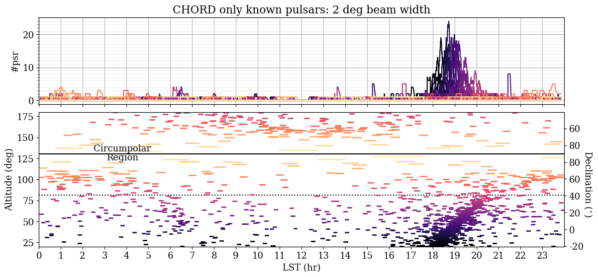
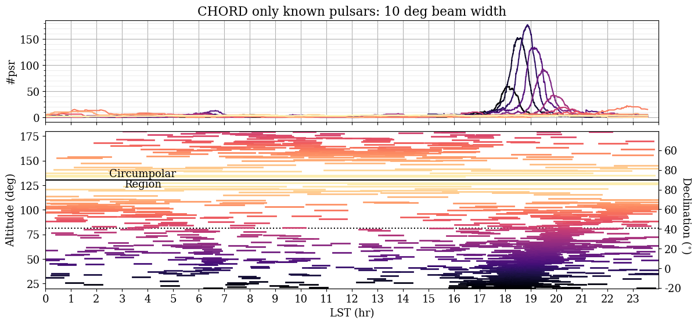

For a given telescope location (example here being CHORD), show the pulsars visible on sky at a given time.
Count the number of pulsars observable as a function of declination/altitude (represented by colours). 
An input file that contains a database of sources is required. The example included comes from the ATNF pulsar catalog taken around early 2021, consisting of a total of 2874 pulsars.

The number of observable pulsars is also dependant on the field-of-view (FOV) of the telescope. 
Two scenarios are shown below, one with a 2 deg FOV and one with 10 deg. 

For a larger FOV, each pulsar is visible for a longer time (the tracks in the lower panel are all longer). So the number of pulsars observable at any given time (upper panel) is also higher. 

