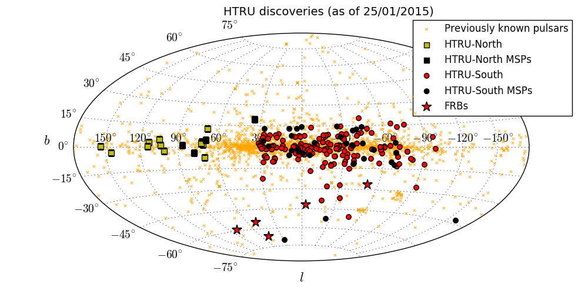

A script to plot HTRU pulsars on hammer projection grid sky. Frist created in 2014 at MPIfR Bonn. 

Usage: `python HTRU-new-pulsars-on-sky.py`

Required input (lists up-to-date as of January 2015):
  "known-pulsars.dat"      : contain 2 columns of Galactic longitude and latitude of all known pulsars.
  "new-HTRU-North.dat"     : 2 columns in RA & Dec 
  "new-HTRU-North-MSP.dat" : 2 columns in RA & Dec
  "new-HTRU-South.dat"     : 2 columns in RA & Dec
  "new-HTRU-North-MSP.dat" : 2 columns in RA & Dec 
  
Optional input:
  To plot FRBs, provide name of frb file as first argument. For example:
  `python HTRU-new-pulsars-on-sky.py FRB.dat`

