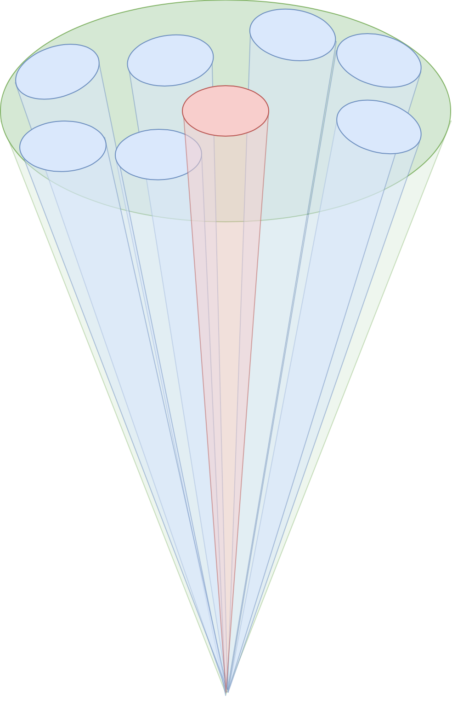

Sketches showing commensal coherent formed beams using interferometric telescopes for SETI searches.
* Green: Instantaneous field-of-view of the telescope (FOV)
* Red: Selected target by the primary observer
* Blue: Commensal coherent formed beams within the FOV, pointing to other targets

