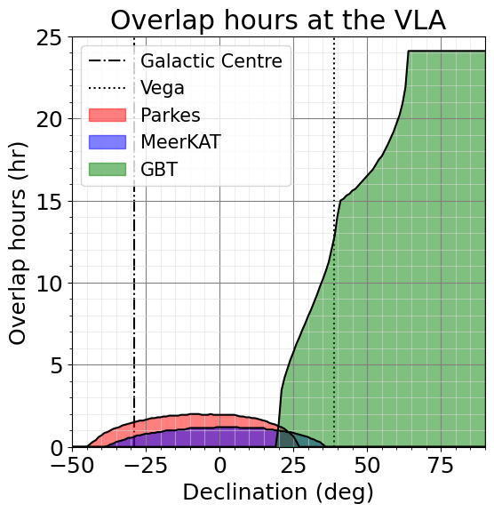
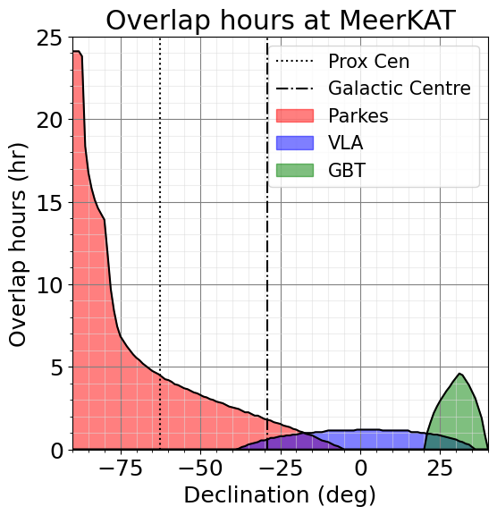

Show the amount of time a source of a given declination is visible jointly at the VLA and other telescopes. 

Show the amount of time a source of a given declination is visible jointly at the MeerKAT and other telescopes.

